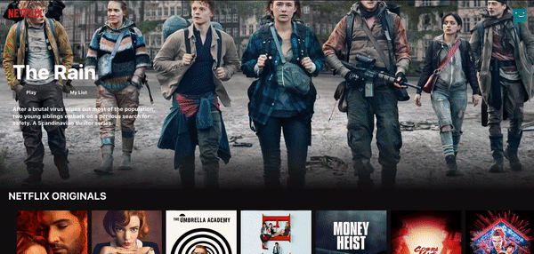
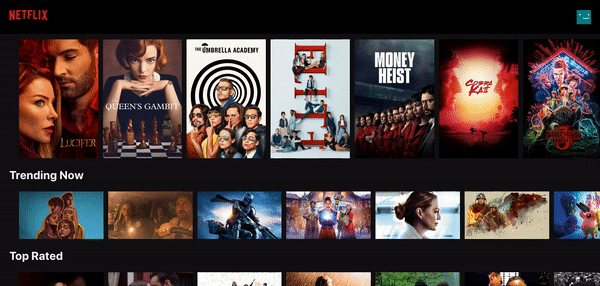

# Netflix Klone

<h1 align="center">
   
  
</h1>

<h4 align="center">A react application recreating the Netflix experience</h4>

A front-end react application integrated with an API :computer:. The API and Axios allows for access to a large selection of movies. The design of this app is detailed to enhance user-experience. It includes the ability to watch trailers :raised_hands: . 

## Check it out!
👉 https://netflix-klone-nv.web.app/ :rocket:

# Demo
### Home

 
### Trailer

 

## For Developers

In the project directory, you can run:

### `npm start`

Runs the app in the development mode.\
Open [http://localhost:3000](http://localhost:3000) to view it in the browser.

The page will reload if you make edits.\
You will also see any lint errors in the console.

### API Docs are located here 👉 https://developers.themoviedb.org/4/getting-started/authorization
